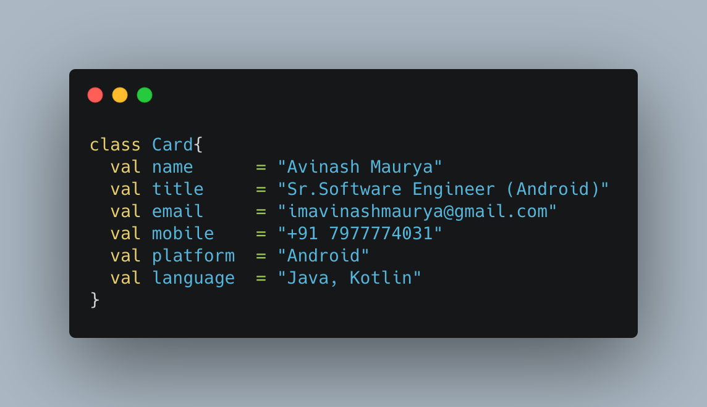

<!--
**imavinashmaurya/imavinashmaurya** is a ✨ _special_ ✨ repository because its `README.md` (this file) appears on your GitHub profile.

Here are some ideas to get you started:

- 🔭 I’m currently working on ...
- 🌱 I’m currently learning ...
- 👯 I’m looking to collaborate on ...
- 🤔 I’m looking for help with ...
- 💬 Ask me about ...
- 📫 How to reach me: ...
- 😄 Pronouns: ...
- ⚡ Fun fact: ...
-->
### Hi 👋 , I'm Avinash
### A passionate android app developer from India</h3>

### Languages and Tools:
<!-- Android --><!-- Kotlin --><!-- Java --><!-- Git --><!-- Android Studio --><!-- Google Play -->

### Connect with me:
<!-- LinkedIn --><!-- Twitter --><!-- StackOverflow --><!-- GitHub -->

### Contact:
<!-- Mail --><!-- Telegram -->

### GitHub Stats:

